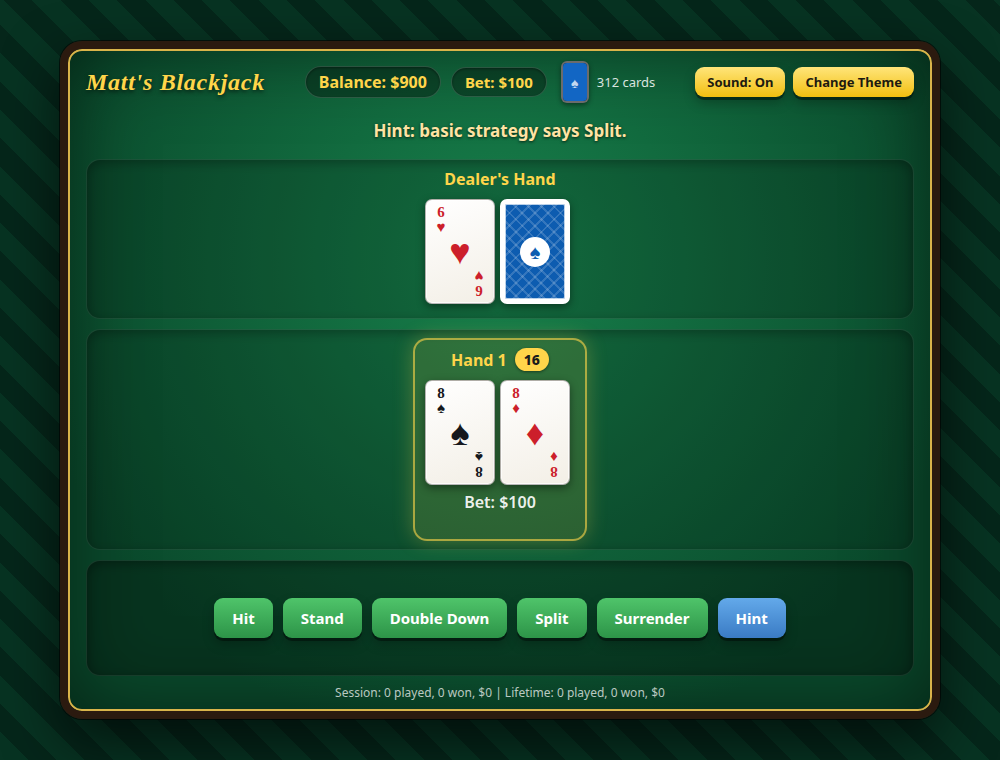

# Advanced Blackjack Game

## ▶️ [Play Now](https://mattgrilli.github.io/blackjack.html)

No download or install needed. Just click the link above and play in your browser.

## Overview

This is an implementation of the classic casino game Blackjack, built with HTML, CSS, and JavaScript. The game features a sleek user interface, realistic chip betting, and adherence to standard Blackjack rules.




## Features

- Realistic chip betting system with multiple denominations
- Type an exact bet amount, or hit **Rebet** to repeat your last wager
- Multi-hand support with splitting functionality
- Double down, surrender, and insurance
- Six-deck shoe with a randomly placed cut card
- Dealer AI that follows standard casino rules
- Animations for card dealing and chip movement
- A felt table with three color themes, and a layout that fits on one screen from phones to desktops
- Session and lifetime statistics tracking
- Hot and cold streak notifications
- **Hint** button that suggests the basic-strategy play (and advises declining insurance)
- Sound effects with a mute button (your choice is remembered)
- Keyboard-friendly: chips are focusable buttons, cards are labeled for screen readers, and results are announced
- Keyboard shortcuts: H (hit), S (stand), D (double), P (split), R (surrender), Enter (deal)

## Running Locally

To play online, use the [Play Now](https://mattgrilli.github.io/blackjack.html) link above. To run your own copy:

1. Clone the repository:
   ```
   git clone https://github.com/mattgrilli/mattgrilli.github.io.git
   ```
2. Navigate to the project directory:
   ```
   cd mattgrilli.github.io
   ```
3. Open `blackjack.html` in your web browser to start the game.

## How to Play

1. Place your bet by clicking on the chips at the bottom of the screen.
2. Click 'Deal' to start the hand.
3. Use the action buttons (Hit, Stand, Double Down, Split) to play your hand.
4. Try to beat the dealer by getting as close to 21 as possible without going over.

## Game Rules

- The dealer must hit on 16 and stand on 17.
- Blackjack pays 3:2, rounded down to a whole dollar.
- Players can split up to three times (four hands total). Only two cards of the same rank can be split.
- Players can double down on any two cards, including after a split.
- Insurance is offered when the dealer's up card is an Ace. It costs half your bet (rounded down, minimum $1) and pays 2:1.
- Surrender returns half your bet (rounded up). It is only available as your first action on an unsplit hand.
- A hand that reaches 21 stands automatically.
- If you run out of money, you can start a new game with $1000.
- Your bankroll resets to $1000 on page reload. Lifetime statistics and the sound setting are saved in your browser; session statistics are not.
- The Hint button follows basic strategy for a multi-deck shoe where the dealer stands on all 17s.

## Technologies Used

- HTML5
- CSS3
- JavaScript (ES6+)

## How It's Built

- `engine.js` - the rules of blackjack (dealing, splitting, insurance, payouts, basic strategy). It has no browser code, so it can be tested in plain Node. It reports what happens through events.
- `script.js` - the page: draws the table, plays sounds and animations, writes the messages and keeps the statistics, all in reaction to the engine's events. Rendering is incremental: cards, hands and chips are keyed, so only what changed is touched and unchanged elements keep their animations and focus.
- `blackjack.html` and `styles.css` - the markup and styling.

## Testing

`blackjack_verify.cjs` tests the rules engine directly in Node and the page wiring in a mocked browser. It includes random-play tests that check money is never created or lost:

```
node blackjack_verify.cjs
```

## Future Improvements

- A protected "vault" balance that can't be bet
- More detailed statistics and an achievement system

## Contributing

Contributions are welcome! Please feel free to submit a Pull Request.

## License

This project is open source and available under the [MIT License](LICENSE).

## Credits

Developed by Matt Grilli

## Contact

If you have any questions, feel free to reach out through GitHub [@mattgrilli](https://github.com/mattgrilli).
