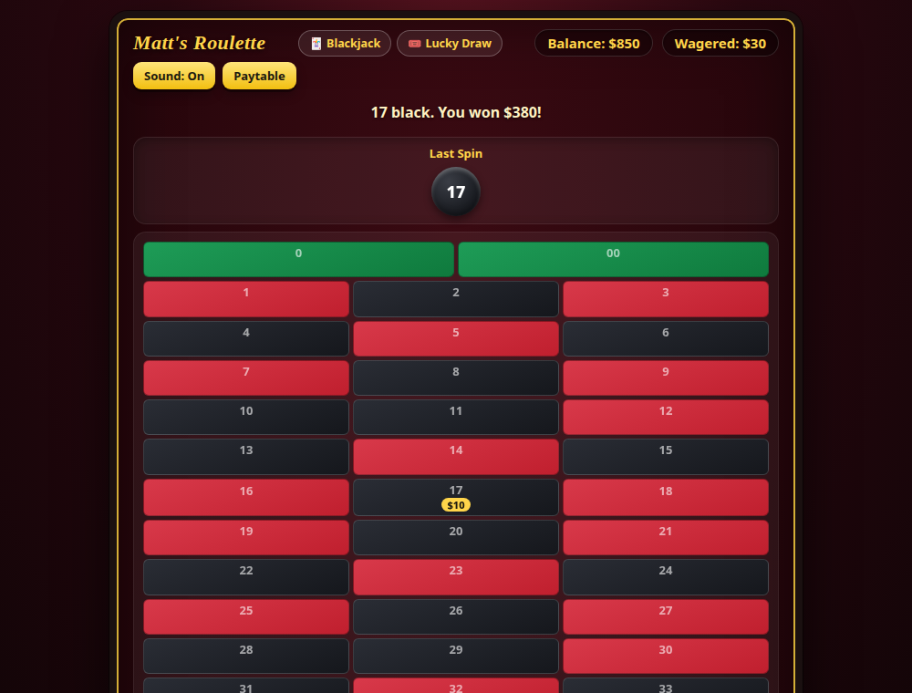

# Advanced Blackjack Game

## ▶️ [Play Now](https://mattgrilli.github.io/blackjack.html)

No download or install needed. Just click the link above and play in your browser.

## Overview

This is an implementation of the classic casino game Blackjack, built with HTML, CSS, and JavaScript. The game features a sleek user interface, realistic chip betting, and adherence to standard Blackjack rules.


## Features

- Realistic chip betting system with multiple denominations
- Type an exact bet amount, or hit **Rebet** to repeat your last wager
- Multi-hand support with splitting functionality
- Double down, surrender, and insurance
- Six-deck shoe with a randomly placed cut card
- Dealer AI that follows standard casino rules
- Animations for card dealing and chip movement
- A felt table with three color themes, and a layout that fits on one screen from phones to desktops
- Session and lifetime statistics tracking
- Hot and cold streak notifications
- **Hint** button that suggests the basic-strategy play (and advises declining insurance). Switch hints off with the **Hints** toggle and the button disappears; the setting is remembered
- Sound effects with a mute button (your choice is remembered)
- Keyboard-friendly: chips are focusable buttons, cards are labeled for screen readers, and results are announced
- Keyboard shortcuts: H (hit), S (stand), D (double), P (split), R (surrender), Enter (deal)

## Running Locally

To play online, use the [Play Now](https://mattgrilli.github.io/blackjack.html) link above. To run your own copy:

1. Clone the repository:
   ```
   git clone https://github.com/mattgrilli/mattgrilli.github.io.git
   ```
2. Navigate to the project directory:
   ```
   cd mattgrilli.github.io
   ```
3. Open `blackjack.html` in your web browser to start the game.

## How to Play

1. Place your bet by clicking on the chips at the bottom of the screen.
2. Click 'Deal' to start the hand.
3. Use the action buttons (Hit, Stand, Double Down, Split) to play your hand.
4. Try to beat the dealer by getting as close to 21 as possible without going over.

## Game Rules

- The dealer must hit on 16 and stand on 17.
- Blackjack pays 3:2, rounded down to a whole dollar.
- Players can split up to three times (four hands total). Only two cards of the same rank can be split.
- Players can double down on any two cards, including after a split.
- Insurance is offered when the dealer's up card is an Ace. It costs half your bet (rounded down, minimum $1) and pays 2:1.
- Surrender returns half your bet (rounded up). It is only available as your first action on an unsplit hand.
- A hand that reaches 21 stands automatically.
- If you run out of money, you can start a new game with $1000.
- Your bankroll resets to $1000 on page reload. Lifetime statistics and your sound and hints settings are saved in your browser; session statistics are not.
- The Hint button follows basic strategy for a multi-deck shoe where the dealer stands on all 17s.

## Technologies Used

- HTML5
- CSS3
- JavaScript (ES6+)

## How It's Built

- `engine.js` - the rules of blackjack (dealing, splitting, insurance, payouts, basic strategy). It has no browser code, so it can be tested in plain Node. It reports what happens through events.
- `script.js` - the page: draws the table, plays sounds and animations, writes the messages and keeps the statistics, all in reaction to the engine's events. Rendering is incremental: cards, hands and chips are keyed, so only what changed is touched and unchanged elements keep their animations and focus.
- `blackjack.html` and `styles.css` - the markup and styling.

## Testing

`blackjack_verify.cjs` tests the rules engine directly in Node and the page wiring in a mocked browser. It includes random-play tests that check money is never created or lost:

```
node blackjack_verify.cjs
```

## Future Improvements

- A protected "vault" balance that can't be bet
- More detailed statistics and an achievement system

---

## 🎟️ Also in This Repo: Matt's Lucky Draw

## ▶️ [Play Lucky Draw](https://mattgrilli.github.io/lottery.html)

A lottery-ticket simulator, play money only. Buy tickets in whatever quantity you like,
then watch a real drawing: 5 numbers from 1-69 plus one "red ball" from 1-26, matching the
format (and the real published odds) of a well-known multi-state drawing game. This
project is not affiliated with or endorsed by any lottery operator — there are no real
tickets, no real drawings and no real prizes.

The real point of it: the built-in paytable shows the actual odds for every prize, so you
can watch just how rarely any of them hit — even the small ones — across as many
drawings as you're willing to sit through. Both games link to each other from their top
bar, so it's easy to switch between them.

### Features

- **Pick your own starting balance** before buying your first ticket &mdash; try $20 or
  $20,000,000 and see how the odds actually play out. It's also what you get back if you
  go broke and start over
- Buy tickets in quick amounts (1, 5, 10, 25, 50), an exact quantity, or hit **Max** to
  spend your whole balance
- Drawing is two steps: **Draw** reveals the winning numbers, then **Check Tickets**
  checks them against your tickets, with its own progress bar &mdash; useful for actually
  watching a huge batch get checked, not just waiting on a frozen page
- A real drawing every time: the odds for every prize tier come from combinatorics, not a
  hardcoded table, and match the real game's published odds exactly (see Testing below)
- A jackpot that grows every drawing nobody wins it, and resets after someone does
- A built-in paytable showing every prize and its real odds
- Session and lifetime statistics; going broke offers a fresh $100 to start over
- Sound effects with a mute button, and a Paytable toggle
- Buy (or win with) thousands of tickets at once without the page freezing &mdash; every
  number stays exact, only the detailed per-ticket list is capped for display
- A hard cap of 1,000,000 tickets per drawing (still $2,000,000 to reach) keeps ticket
  generation itself fast and the tab from running out of memory on an unreasonable request
- **Simulate many drawings at once**: run up to 100,000 real, independent drawings in a
  row automatically (same odds every time, just automated), buying a chosen number of
  tickets each round. The jackpot rolls over naturally across the whole run &mdash; a
  useful way to actually see it grow to something dramatic, and to see just how rarely
  even a huge number of real chances turns into a real win. Stoppable at any time; ends
  with a summary (drawings run, spent, won, biggest win, jackpots hit)

### Rules

- Tickets cost $2 each. Each one is quick-picked: 5 numbers from 1-69, plus one "red ball"
  from 1-26.
- Prizes range from $4 (matching just the red ball) up to $1,000,000 (matching all 5 white
  numbers), and the jackpot — starting at $20,000,000 — for matching all 6.
- The jackpot grows by $3,000,000 every drawing nobody wins it, and resets to $20,000,000
  after a win.

### How It's Built

- `lottery-engine.js` — the drawing mechanics and odds. No browser code, so it can be
  tested in plain Node; it reports what happens through events.
- `lottery.js` — the page: renders the ticket kiosk, plays sounds, and keeps statistics,
  all in reaction to the engine's events.
- `lottery.html` and `lottery-styles.css` — the markup and styling.

### Testing

`lottery_verify.cjs` checks that the engine's odds match the real game's published odds
exactly (down to the tier), plus the page wiring in a mocked browser, plus random-play
fuzz tests that check no money is ever created or lost:

```
node lottery_verify.cjs
```

---

## 🎰 Also in This Repo: Matt's Roulette

## ▶️ [Play Roulette](https://mattgrilli.github.io/roulette.html)

An American (double-zero) roulette simulator, play money only. Place straight-up numbers
or any of the standard outside bets — red/black, odd/even, 1-18/19-36, dozens, columns —
and spin. This project is not affiliated with or endorsed by any casino — there's no real
wheel, no real bets, no real payouts.



### The point of it

Every bet offered here carries exactly the same real house edge — 5.26% — whether it pays
1:1 (betting red) or 35:1 (betting a single number). That's not a simplification; it falls
straight out of the math (38 pockets, and every payout here is priced for exactly 2 fewer
winning pockets than a fair payout would need). The built-in paytable shows the real odds
and edge for every bet, computed the same way, not hand-typed.

### Features

- A real betting table: 0, 00, and 1-36, correctly colored, plus the outside bets, with a
  chip you select and then click a spot to bet
- Place several bets at once per spin, same as a real table
- **Pick your own starting balance** before betting, which also becomes what a later New
  Game gives back
- **Simulate many spins at once**: replay your currently placed bets as a repeating
  pattern for up to 100,000 real, independent spins in a row — a fast way to watch the
  5.26% edge grind away at a bankroll over a realistic number of trials, not just one spin
  at a time. Stoppable at any time; ends with a summary
- Session and lifetime statistics; sound effects with a mute button; a Paytable toggle

### Rules

- American double-zero wheel: 38 pockets (0, 00, 1-36), 18 red and 18 black, 0 and 00
  green. 0 and 00 lose every outside bet (no surrender/en-prison rule).
- Straight up pays 35:1, the six outside even-chance bets (red/black, odd/even, 1-18/
  19-36) pay 1:1, and dozens/columns pay 2:1. Every one of these has exactly a 5.26% house
  edge.
- Not offered: the inside combination bets (split, street, corner, six-line) or the
  American-only five-number 0/00/1/2/3 "basket" bet, which is the one well-known exception
  with a worse 7.89% edge. See Future Improvements.

### How It's Built

- `roulette-engine.js` — the wheel, the bet menu and the real odds math. No browser code,
  so it can be tested in plain Node; it reports what happens through events.
- `roulette.js` — the page: the betting table, chips, sounds and statistics, all in
  reaction to the engine's events.
- `roulette.html` and `roulette-styles.css` — the markup and styling.

### Testing

`roulette_verify.cjs` checks that every bet type's house edge matches the real, published
5.26% American roulette edge (re-derived independently from the bet menu's own win
conditions, not just echoed from a table), plus the page wiring in a mocked browser, plus
random-play fuzz tests that check no money is ever created or lost:

```
node roulette_verify.cjs
```

### Future Improvements

- The inside combination bets (split, street, corner, six-line) and the five-number basket
  bet, which would need precise spatial click-zones on the table
- A European (single-zero) wheel option, with its better 2.70% house edge

## Contributing

Contributions are welcome! Please feel free to submit a Pull Request.

## License

This project is open source and available under the [MIT License](LICENSE).

## Credits

Developed by Matt Grilli

## Contact

If you have any questions, feel free to reach out through GitHub [@mattgrilli](https://github.com/mattgrilli).
